# JobCheck 项目报告 —— 背景 · 需求 · 实现 · 架构

> 报告日期：2026-09-02 · 基于仓库当前状态（v0.6.1 已提交 `4edf39d`，v0.6.2 已完成待提交）
> 文中架构图/流程图/ER 图均为 Mermaid，可在 GitHub、VS Code（Mermaid 插件）、新版 PyCharm 的 Markdown 预览中直接渲染；
> 或打开同目录 [PROJECT_REPORT.html](PROJECT_REPORT.html)，浏览器中即开即看（图表需联网加载 mermaid.js）。

---

## 摘要

**JobCheck 是一个面向秋招求职者的多用户岗位投递状态追踪平台**：用户把投递过的公司招聘门户接入平台，平台通过浏览器扩展在用户访问时被动捕获投递页数据，归一化为统一状态机，在一个看板上集中管理；无法自动抓取的渠道支持手动记录，与自动记录混排展示。

经过一次关键架构重构（2026-09-01），项目确立了「**浏览器作为兼容层，Cookie 永不离开浏览器**」的核心路线：扩展上报快照、后端现场解析，替代原先「扩展上传 Cookie + 服务端定时轮询重放配方」的方案，直击真实站点接入中 3.5/4 失败都发生在采集层的痛点。

| 关键指标 | 数值 |
|---|---|
| 统一状态机 | **14** 个细分状态（`backend/app/domain/statuses.py`） |
| 测试基线 | **143 passed**（18 个测试文件 + golden 样本回归） |
| golden 回归样本 | **13** 个（覆盖飞书/北森/Moka/携程/腾讯 + 陷阱样本 + DOM 兜底） |
| 数据表 | **13** 张 ORM 表 + `app_tags` 关联表（SQLite WAL） |
| 解析引擎 | **4** 层优先级：平台规格 → portal hints → 启发式/embedded → DOM 兜底 |
| 扩展采集钩子 | **4** 层：fetch / XHR / JSON.parse / Response.json（MAIN world 只读包装） |
| LLM 用途 | 2 个窄用途（T1 配方生成、T2 状态兜底分类），月预算 **¥100** 熔断 |
| 目标规模 | 境内轻量云 2C4G，≤50 用户，SQLite（保留迁 PostgreSQL 路径） |

---

## 1. 项目背景

### 1.1 要解决的问题

秋招求职者会在几十家公司官网投递简历，投递进度分散在各公司自建的招聘门户（及 Moka、飞书招聘、北森等 ATS 供应商站点）：

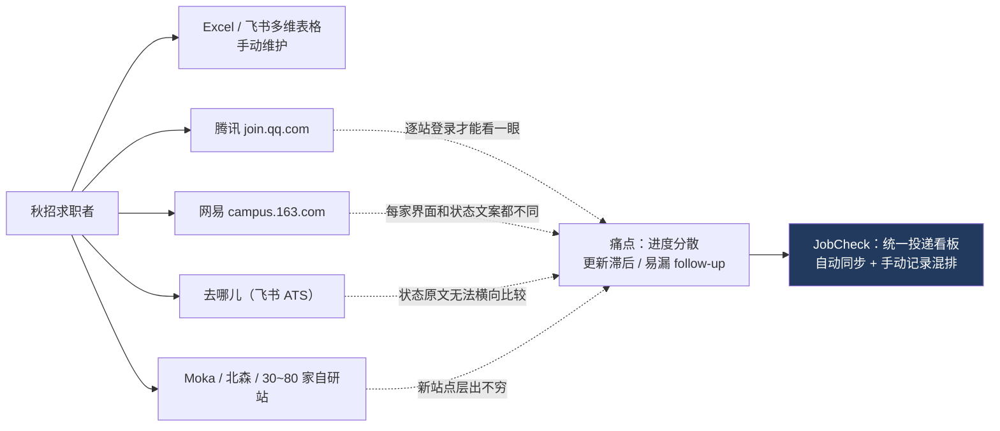

竞品调研结论（`REFACTOR_PLAN.md` / `DESIGN.md` §5）：国外产品（Huntr/Teal）只做「一键捕获职位 + 手动管状态」；国内产品（Offer情报局/OfferLink 等）全部是「网申自动填表 + 手动进度管理」。国内秋招用户用飞书多维表格手动追几十个投递点，痛点真实存在，但市场上缺少「自动聚合各门户状态」的工具。

### 1.2 产品定位与红线

- **定位**：为秋招求职者提供的多用户岗位投递状态追踪平台（`DESIGN.md` §1）。
- **四条不可协商的产品红线**：
  1. **只读**：绝不代投简历、绝不自动投递、绝不自动沟通；
  2. 适配器规范**禁止请求任何写操作端点**；
  3. 用户可**一键注销并级联删除全部数据**（含 Cookie）；
  4. **不存储简历文件**；遇验证码不破解。

### 1.3 目标用户与规模约束

- 邀请码制注册（`python -m scripts.make_invite --uses 10`），个人运营；
- 部署目标：境内轻量云 2C4G、Nginx + HTTPS、≤50 用户、SQLite（WAL + 外键）；
- 自研站长尾约 30–80 家，「逐站人工抓包写配方对个人运营者不可扩展」——这直接催生了后文的自动配方管线与快照架构。

---

## 2. 需求

### 2.1 功能需求

| 需求域 | 内容 | 现状 |
|---|---|---|
| 账户体系 | 邮箱 + 密码 + 邀请码注册、登录、注销（级联删除） | ✅ |
| 手动记录 | 投递 CRUD（公司/岗位/批次/标签/原文/备注）、状态历史时间线 | ✅ |
| 自动追踪 | 浏览器扩展被动捕获投递页 → 快照上报 → 自动建卡/更新状态 | ✅（唯一主链路） |
| 统一看板 | 14 态压缩为 6 阶段列、筛选（搜索/批次/标签/来源/状态）、终态列折叠 | ✅ |
| 个人统计 | 「我的数据」侧边栏：总量/进行中/已结束/本月新增/流程分布（`GET /api/me/stats`） | ✅ v0.6.1 |
| 接入体验 | 6 位配对码（10 分钟有效）配对扩展；「同步当前页」手动兜底；每小时后台自动回访 | ✅ |
| 管理后台 | 概览趋势、快照链路健康度（捕获率/解析率/重解析）、用户、投递数据、LLM 用量，纯只读 | ✅ |
| 未知门户接入 | 采样 → 结构指纹/LLM 生成配方 → 回放验证 → 免审批发布（辅助链路，保留） | ✅ 代码保留 |

### 2.2 非功能需求

- **安全/合规**：Argon2id 密码哈希；签名 Cookie 会话（`jc_session`，14 天）；绑定 Cookie AES-256-GCM 加密落库；设备令牌只存 sha256；上报前 PII 打码（16 个键）；扩展采集为**只读包装**。
- **成本**：LLM 仅两个窄用途且月预算 ¥100 熔断；飞书等已知平台走模板**零 AI 成本**；日常轮询零 LLM。
- **可维护性**：「解析 bug 服务端热修，不再发插件」——快照解析逻辑全在后端，扩展只负责采集。
- **质量纪律**（`HANDOFF.md` §0）：每个真实失败形态沉淀 golden/回归用例；任何改动后 `python -m pytest -q` 全绿；看板/手动记录/状态机/T2 分类零回归。

### 2.3 里程碑与演进

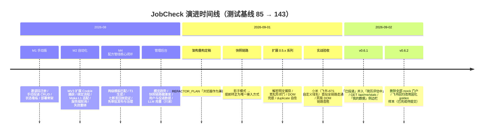

里程碑完成度：

| 里程碑 | 内容 | 状态 |
|---|---|---|
| M1 手动版 | 账号、手动 CRUD、看板 | ✅ 完成 |
| M2 自动化 | 插件捕获、绑定、轮询 | ✅ 完成（后被快照链路替代） |
| M3 上线 | 境内部署 + ICP 备案、管理后台 | ◐ 管理后台已完成；部署备案未做 |
| M4 自动配方管线 | 指纹/T1/七断言/发布/治理/golden 回归 | ✅ 核心闭环完成；余项见 §6 |
| 重构 M0–M2 | 基线复核 → 快照影子模式 → 转正 | ✅ 完成（跳过 M3 闸门直接转正） |

### 2.4 关键设计决策（摘自 `DESIGN.md` §12 决策记录，共 15 条）

1. 多用户产品，邀请码制；仅覆盖**公司官网直投**，第三方招聘平台不做。
2. 登录态由浏览器扩展在用户正常访问时捕获，**不要求用户手动粘贴 Cookie**（新架构下 Cookie 根本不离开浏览器）。
3. 统一状态机**尽量细分**（14 态）+ 门户**原文永远保存**（`raw_status_text`）+ 历史记录，规则表更新后可对历史重放。
4. 模板优先：两级匹配（域名表 → 结构指纹），都不中才走 LLM；agent 只生成单站配方，自研配方永不提升为平台模板。
5. LLM 提前引入但用途**极窄**（T1/T2），一切 LLM 输出必须通过确定性回放验证；LLM 输出无代码执行能力（解释器只支持白名单原语）。
6. 所有登录用户可触发生成，**无管理员审批**——闸门 = Schema 校验 + 回放验证。

---

## 3. 总体架构

### 3.1 系统架构图

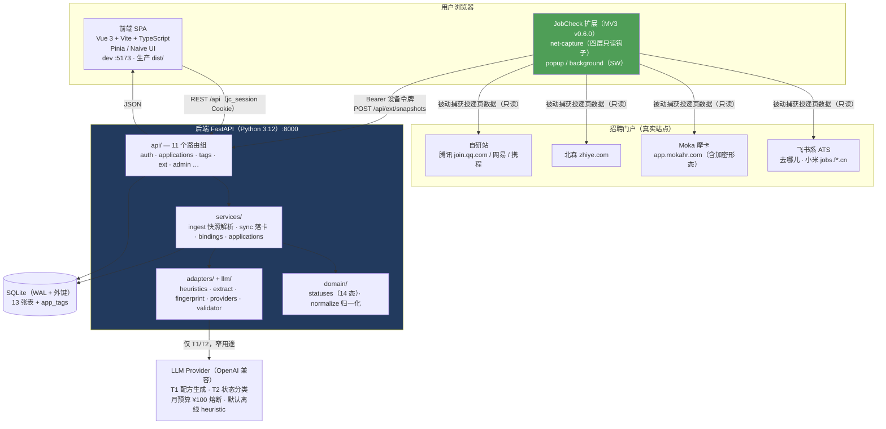

### 3.2 技术栈

| 层 | 技术 |
|---|---|
| 前端 | Vue 3.4 / Vite 5 / TypeScript 5.5 / Pinia 2 / vue-router 4 / Naive UI 2.38（浅色定制主题 #223a5e）/ Chart.js 4（仅管理后台） |
| 扩展 | Chrome/Edge Manifest V3（service worker + alarms，MAIN world 内容脚本） |
| 后端 | Python 3.12 / FastAPI / SQLAlchemy 2 / Pydantic v2 / httpx / lxml / APScheduler |
| 数据库 | SQLite（WAL、外键 ON；保留迁 PostgreSQL 路径） |
| 安全 | Argon2id 密码哈希 · itsdangerous 签名 Cookie · AES-256-GCM Cookie 加密 |
| LLM | OpenAI 兼容协议自写薄客户端（httpx + pydantic，配置驱动换模型）；默认 `LLM_PROVIDER=heuristic` 零成本 |
| 测试 | pytest（143 项）+ 13 个 golden 样本回归 |
| 部署 | 本地 `start_dev.bat`（后端 8000 + 前端 5173 代理 /api）；生产规划 Nginx + HTTPS + Docker Compose + ICP 备案 |

### 3.3 新旧双链路：为什么重构、重构了什么

2026-09-01 的四站复盘结论：**3.5/4 次接入失败发生在采集层**（服务端/扩展与站点对话的环节），管线本身（指纹/七断言/发布）没有输过一场；绑定后的服务端轮询也持续暴露契约脆弱性（CSRF 轮换、需 405 自愈、每站都要修）。业界调研（Huntr/Teal/JobRight/国内产品/Distill）无一例外：**数据在用户访问时采集，服务端不存凭证轮询**。

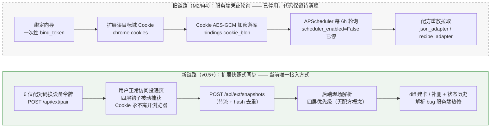

新旧链路关键差异：

| 维度 | 旧链路 | 新链路（现行） |
|---|---|---|
| 凭证 | Cookie 加密存服务端 | **Cookie 不离开浏览器** |
| 抓取时机 | 服务端定时（默认 6h） | 用户访问时 + 扩展每小时静默回访 |
| 站点适配 | 预生成配方重放（契约脆弱：CSRF/405/分页） | 现场解析快照数据，解析逻辑可服务端热修 |
| 适配成本 | 每站修一次后端 | 平台规格/启发式自动覆盖，hints 自学习 |

> 采样→配方管线（`samples`/`recipes`）与绑定链路的**代码仍保留**：ConnectWizard 仍支持「未支持网站采样接入」，绑定支持手动刷新同步（`POST /api/bindings/{id}/refresh`）；仅服务端定时轮询已关闭。旧架构删除计划见 §6.2。

### 3.4 部署形态

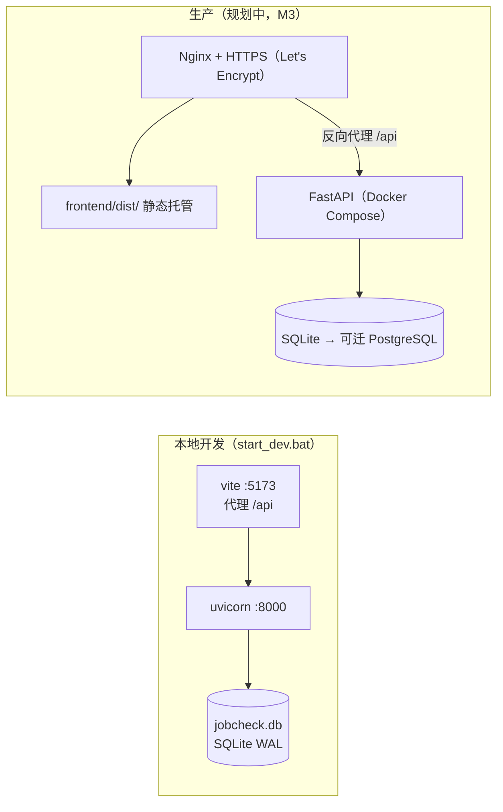

---

## 4. 核心实现

### 4.1 端到端快照链路（主链路时序）

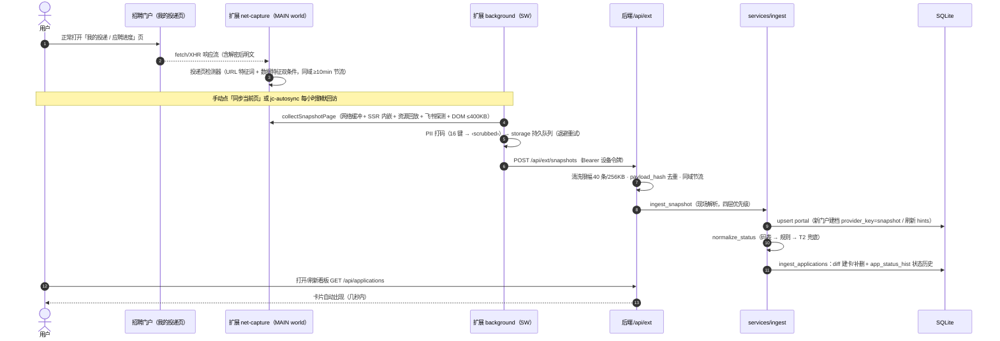

### 4.2 扩展端：四层采集钩子与上报链路

`extension/manifest.json`（MV3，version 0.6.0）：`net-capture.js` 以 `document_start + world: MAIN` 注入所有 http(s) 页面，对页面网络栈做**只读包装**；`background.js`（service worker，922 行）负责配对、采集、队列与自动同步。

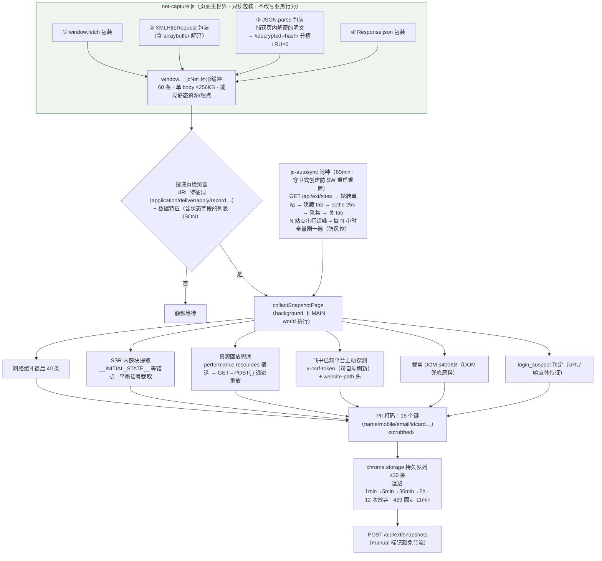

要点：

- **加密站点破局**（Moka `{"data": 密文}` AES-256-CBC）：传输加密但页面内解密——`JSON.parse` 包装能拿到解密后明文，落 `#decrypted-*` 槽位；内容前缀哈希分槽 + LRU 保留最近 6 个，避免互相覆盖。
- **宽松形状门**：任何「≥1 字典且字典 ≥3 键」的数组都进候选（v0.5.3 起），**扩展不做预判**，判断全部交给后端——这是「解析逻辑热修」路线的延伸。
- **已知上限**：解密发生在 Web Worker 的站点（如星环，postMessage 回主线程为克隆对象）页面侧钩子原理上不可见——由 DOM 兜底路径接手。

### 4.3 后端解析引擎：四层优先级（`backend/app/services/ingest.py`）

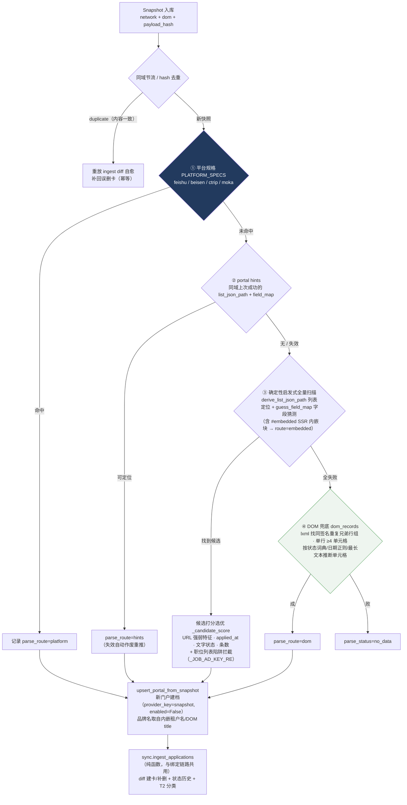

内置平台规格（真实站点采样校准）：

| 平台 | 列表定位 | 状态取值特征 |
|---|---|---|
| 飞书 ATS | `data.delivery_list` | `operation_list` 末项 `operation_code`：`^0$/^1$`→screening、`^3$`→written_test |
| 北森 | `Data.*.Submissions.*.Datas`（分组列表，`*` 展开） | 中文状态原文走规则表 |
| 携程 | `applyJobAdList` | `phaseInfoCN + statusInfoCN` 拼接 |
| Moka | `data.list` | 依赖 `#decrypted` 解密明文槽位 |

### 4.4 统一状态机（14 态）

定义于 `backend/app/domain/statuses.py`，单一事实来源：后端做校验与历史记录，前端经 `GET /api/meta` 取同一份渲染看板列。**模型是「扁平枚举 + 校验」而非受限转移表**——任意合法状态间可人工/自动流转，每次变更写入 `app_status_hist`（from → to + 原文）；下图箭头表示的是**业务阶段顺序**（归一化与看板排序的依据）：

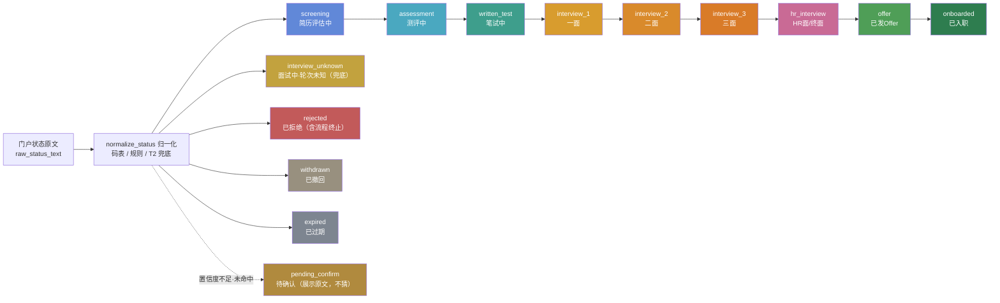

- 状态构成：**进行阶段 9 + 兜底 1 + 终态 3 + 待确认 1**；
- 两个历史合并（v0.6.1，2026-09-02）：「已投递 applied」并入 `screening`（归一化几乎总映射到更后阶段，该列长期空）；「流程终止 closed」并入 `rejected`；原文语义均由 `raw_status_text` 保留；
- 前端展示层（`frontend/src/utils/stages.ts`）把 14 态压缩为 **6 个阶段列**，细分信息不丢失（列头筛选片 + 卡片徽标）：

| 看板阶段列 | 包含状态 | 备注 |
|---|---|---|
| 待确认 | pending_confirm | |
| 简历评估 | screening | |
| 测评/笔试 | assessment, written_test | |
| 面试中 | interview_1/2/3, hr_interview, interview_unknown | |
| Offer / 入职 | offer, onboarded | |
| 已结束 | rejected, withdrawn, expired | 可折叠，<1600px 默认收起 |

### 4.5 状态归一化与 T2 兜底分类

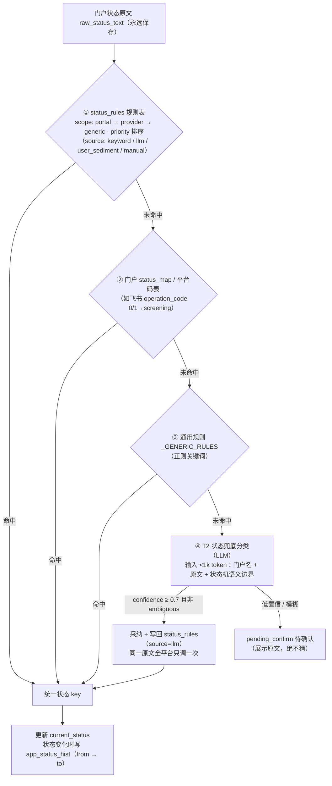

### 4.6 数据模型（ER 图）

13 张 ORM 表 + `app_tags` 关联表，SQLite（WAL、外键 ON），轻量迁移用 `_ensure_columns()` 兜底。

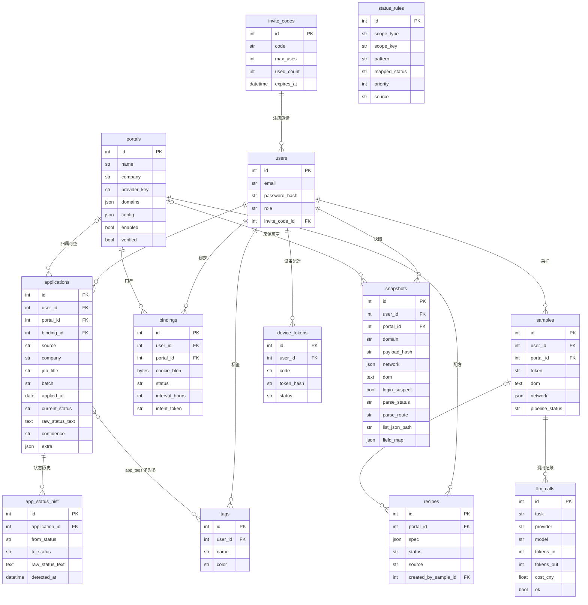

新链路核心表是 **snapshots**：一条快照保留 network/dom 原料、`payload_hash` 去重键、`parse_status`/`parse_route` 解析结果、以及沉淀为 portal hints 的 `list_json_path` + `field_map`（同域下次快照优先复用，失效自动重推）。

### 4.7 LLM 子系统：窄用途 + 确定性闸门

三总原则（`LLM_DESIGN.md`）：**LLM 理解一次、引擎确定性执行**；一切 LLM 输出必须通过回放验证；LLM 输出无代码执行能力（解释器只支持白名单原语 CSS 选择器/JSONPath/等待/滚动，天然沙箱）。日常同步零 LLM。

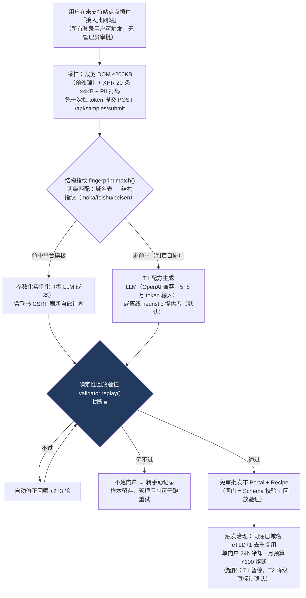

**回放验证七断言**（全部通过才发布，反幻觉闸门）：

1. 提取记录数 ≥1 且 ≤500；2. `job_title`/`status_raw` 非空率 100%；3. `status_map` 覆盖每个不同原文（或显式兜底）；4. 提取结果与 LLM 自述清单逐条一致；5. `item_selector` 命中节点 ≤200；6. `login_success` 能区分采样包状态；7. **用户标识参数化**（配方任何位置不得出现采样用户特有标识值）。

成本量级：T1 每门户一次性约几分钱（全量 80 家 ≈ 几十元）；T2 每次不足 1k token，月成本个位数元。

### 4.8 前端实现

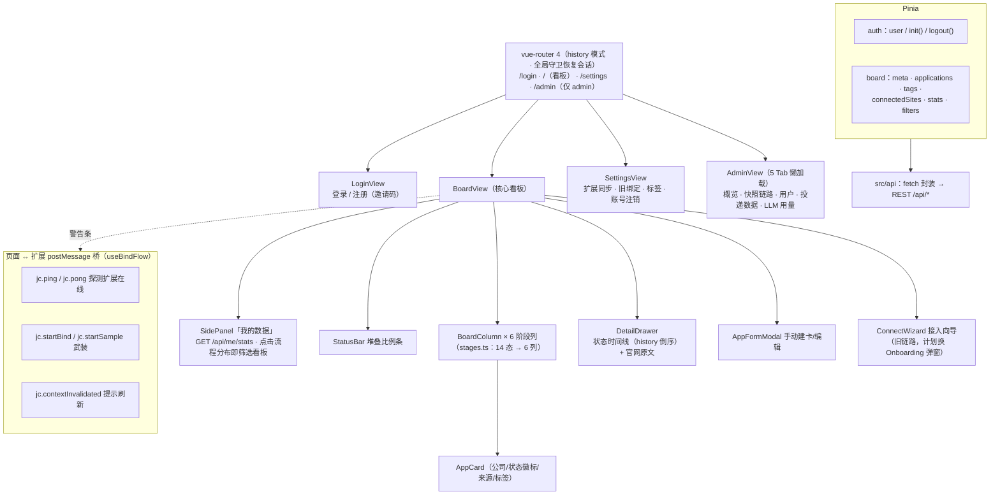

- 看板两类黄条：旧链路「绑定登录态失效」与新链路「站点疑似未登录」（`login_suspect`），去站点重登一次即恢复；
- 双色纪律：「彩色只用于编码状态，其余界面保持墨色/灰阶」；
- 前端目前无自动化测试，仅 `public/jc-e2e.html` 手动全链路驱动页（与扩展走同一套 postMessage 契约）。

### 4.9 API 一览（全部挂 `/api` 前缀）

| 路由组 | 端点 | 说明 |
|---|---|---|
| auth | `POST /auth/register` `POST /auth/login` `POST /auth/logout` `GET /auth/me` | 邀请码注册、签名 Cookie 会话 |
| applications | `GET/POST /applications`、`GET/PATCH/DELETE /applications/{id}` | 手动 CRUD + 多维筛选 + 详情含历史 |
| tags | `GET/POST /tags`、`PATCH/DELETE /tags/{id}` | 标签（用户内唯一） |
| me | `GET /me/stats` | 个人统计（v0.6.1） |
| meta | `GET /meta` | 状态机/批次定义（前后端单一事实来源） |
| account | `DELETE /account` | 验密码注销，级联删除 |
| portals | `GET /portals`、`POST /portals/identify`、`GET /portals/connected` | 门户库/URL 识别/已连接站点 |
| bindings | `GET/POST /bindings`、`POST /bindings/activate`、`GET /bindings/intents/{token}`、`POST /bindings/{id}/refresh`、`POST /bindings/{id}/relogin`、`DELETE /bindings/{id}` | 旧链路绑定（轮询已停，可手动刷新） |
| samples | `POST /samples/intents` `POST /samples/submit`、`POST /samples/{id}/retry`、`GET /samples/mine`、`GET /samples`、`GET/PATCH /samples/{id}` | 采样→配方管线 |
| admin | `GET /admin/overview` `users` `applications-stats` `llm-usage` `llm-calls` `snapshots` `snapshots/stats` `recipes`、`POST /admin/snapshots/{id}/reparse` | 管理后台（只读 + 干跑重解析） |
| ext | `POST /ext/pair-code` `POST /ext/pair`、`GET /ext/me` `GET /ext/sites`、`POST /ext/snapshots` | **扩展专用**，Bearer 设备令牌 |
| 根 | `GET /api/health`、`GET /api/extension/download` | 健康检查、扩展 zip 打包下载 |

### 4.10 安全设计小结

| 风险 | 对策 |
|---|---|
| 凭证泄露 | 新链路 Cookie 不离开浏览器；旧链路 Cookie AES-256-GCM 加密 + 密钥版本化 |
| 会话伪造 | itsdangerous 签名 Cookie（14 天），Argon2id 密码哈希 |
| 设备令牌泄露 | 后端只存 sha256，配对码 6 位 10 分钟一次性 |
| 隐私 | 上报前 PII 打码 16 键；每域快照只保留 20 条裁剪副本；一键注销级联删除 |
| LLM 滥用/幻觉 | 白名单原语、七断言回放、月预算熔断、T2 低置信落「待确认」不猜 |
| 越权写操作 | 只读红线：适配器禁止写端点；扩展钩子只读包装不改写行为 |

---

## 5. 质量保障

### 5.1 测试基线：143 passed

`backend/tests` 共 18 个测试文件，`pytest --collect-only` 实测 143 项（含 golden 参数化 8 例）。基线演变：**85**（M0 复核）→ 114（快照转正）→ 119 → 124 → 125 → **143**（当前）。主要分布：

| 测试文件 | 数量 | 覆盖域 |
|---|---|---|
| test_ext_snapshots.py | 25 | 配对/节流/去重/落卡/DOM 兜底/多租户隔离/hints 缓存修复 |
| test_ingest_parse.py | 18 | 解析引擎 golden 回归 + 陷阱拒绝 |
| test_applications.py / test_llm_validator.py | 各 9 | 手动 CRUD / 七断言验证器 |
| test_auth.py / test_beisen_template.py / test_recipe_runtime.py | 各 8 | 认证邀请码 / 北森模板 / 配方运行时 |
| test_llm_pipeline.py / test_feishu_template.py | 各 7 | 配方管线 / 飞书模板（golden `feishu_like.json`） |
| test_m2_bindings / test_llm_preprocess / test_classify_rules / test_admin_dashboard | 各 5 | 绑定 / 预处理 PII / 规则表 / 管理后台聚合 |
| test_heuristics / test_page_recipe | 各 4 | 启发式 / SSR page 配方 |
| test_me_stats / test_samples / test_tags_account | 各 3 | 个人统计 / 采样 / 标签与注销级联 |

### 5.2 golden 样本集（`backend/tests/golden_samples/`，13 个）

`feishu_like / feishu_qunar_like / xiaomi_feishu_like`（飞书系三种形态）、`tencent_like`（单对象列表/数字码/resumeId）、`beisen_like`（虹科真实采样脱敏：分组列表/中文原文/空 POST 体）、`ctrip_like`、`moka_like / moka_encrypted_like`（AES 加密形态）、`moka_jobslist_trap_like + beisen_*_trap_like`（职位列表冒充投递的**陷阱样本**，必须被拒绝）、`bilibili_dom_like / moka_yanhun_dom_like`（DOM 兜底路由）。纪律：**每个真实失败形态沉淀 golden/回归用例，防止「修一个丢一个」**。

### 5.3 实战胜负记录（均已修复并有回归）

| 事故 | 根因 | 修复 |
|---|---|---|
| Moka 站 no_data | 响应体 `data` 字段 AES-256-CBC 加密 | `JSON.parse` 只读包装捕获页内解密明文 → `#decrypted-*` 分槽（v0.5.2/0.5.3） |
| 星环二测 15 张错卡 | 105KB 解密对象实为站点启动配置/职位列表 | 候选打分 + 职位列表陷阱拦截 + trap golden |
| 星环最终判定不可钩 | 解密在 Web Worker，postMessage 克隆对象页面不可见 | DOM 兜底路径接手（网易 DOM 链路首胜） |
| 网易「数据与上次一致」 | `payload_hash` 只算 network 不算 dom | dom 纳入哈希 + 回归 |
| duplicate 误删卡不回 | 去重直接跳过 | duplicate 时重放 ingest diff 自愈（幂等补建） |
| `jc-autosync` 从未触发 | SW 每分钟被唤醒反复重置闹钟 | 守卫式创建 + 启动补跑（≥55min） |
| popup 吞失败 | 只看 HTTP 2xx | 结果文案透传 parsed/duplicate/no_data/queued |
| 飞书 CSRF 轮换 | csrf-token 过期 | `csrf_refresh` 自愈计划 + `${cookie:NAME}` 头派生 |

### 5.4 接入验收标准

**「连续 3 个新真实站点零改动出卡」**——先于旧架构清理执行；当前已验收小米（飞书 ATS 自定义域名站）、网易（DOM 兜底）等。

---

## 6. 当前状态与路线

### 6.1 完成度总览

- ✅ 手动记录全链路、快照自动同步全链路（唯一接入方式）、状态机与归一化、管理后台、飞书/北森/Moka/携程平台规格、LLM 配方管线核心闭环；
- ✅ 真实门户库 9 家（v0.6.2 删除全部 mock 后全部为真实门户）：腾讯、网易、携程、去哪儿、小米等已登记；
- ◐ v0.6.2 已完成待提交（删 mock 门户、飞书回归改用固化 golden，7 用例全过）；
- 环境现场：后端 `127.0.0.1:8000`；星环失败现场留证在 `snapshots` 表 id=1、`samples` 表 #30–32（**勿删**）。

### 6.2 待办（按序）

1. **真实站点验证**（验收标准不变：连续 3 个新真实站点零改动出卡）；
2. **旧架构清理**：删后端 scheduler/adapters/llm 管线相关约 1400 行旧测试 → 扩展删 bind/sample 流程、popup 重写、manifest 去 `cookies` 权限 → 前端 ConnectWizard 换 Onboarding 弹窗 → e2e 重写（jc-e2e.html 驱动「访问→上报→卡片」）+ 文档重写；
3. **M3 上线**：境内部署 + Docker Compose + Nginx + ICP 备案；
4. **M4 余项**：真实 LLM 提供者线上标定（腾讯/网易/携程首批采样）、dom 型配方的 Playwright 运行时、用户手改状态沉淀映射候选；
5. **后续路线**：邮件解析增强（IMAP 只读通知邮件）、插件本地提取（L3）。

### 6.3 主要风险

- 自研站长尾（30–80 家）依赖启发式 + DOM 兜底的泛化能力，需持续用 golden 沉淀失败形态；
- LLM 线上标定未做，当前默认 heuristic 提供者（零成本但覆盖有限）；
- 前端无自动化测试，回归依赖后端 143 项基线 + 手动 e2e 驱动页。

---

## 附：文档地图

| 文档 | 内容 |
|---|---|
| `README.md` | 产品总览、接入指南、里程碑进度 |
| `DESIGN.md` | 产品设计总纲（15 条决策记录） |
| `REFACTOR_PLAN.md` | 快照架构重构方案与一刀切清单 |
| `LLM_DESIGN.md` | LLM 子系统设计（T1/T2/七断言/治理/成本） |
| `HANDOFF.md` | 交接文档（当前状态、操作手册、事故记录） |
| `M0_BASELINE.md` | 重构开工前基线盘点 |
